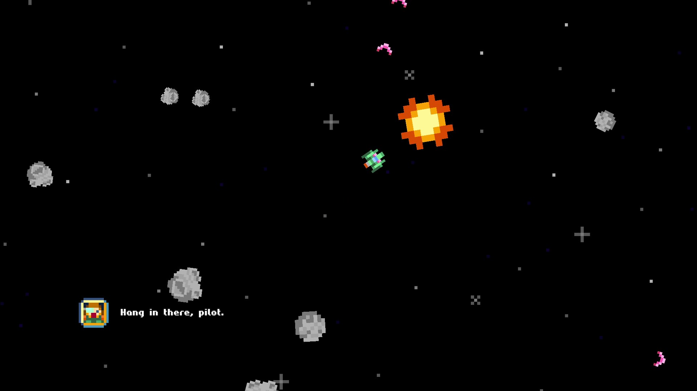
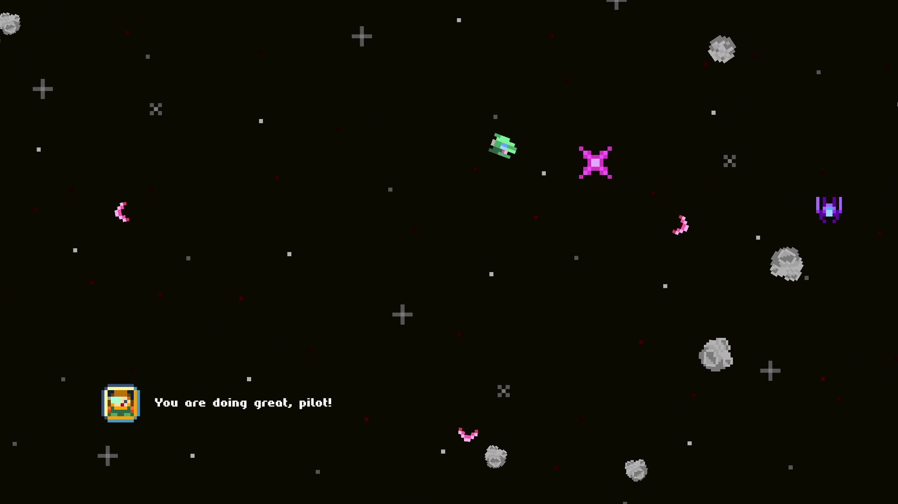
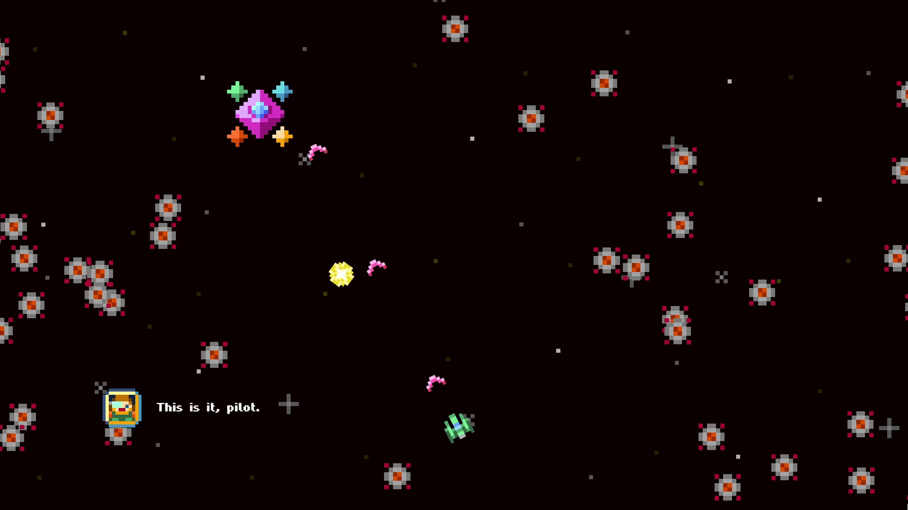

# 🚀 Spaceshooter
A small game made as a part of module Software Architecture for Games at Northumbria University Newcastle.
The aim of the project was to develop a functional game engine and create a game using it.

## 🛠️ Game Engine Architecture
The game engine uses an Entity Component System (ECS) architecture, a modern game engine architecture targeting to optimize performance, reusability, and versatility. Game objects are composed of independent components, each of which manages some of their functionality, such as position, animation, or collision. This results in a very powerful software architecture with natural use of composition over inheritance, high cohesion, and low coupling.

The game and the engine were writen in C++

## 📷 Screenshots

---

**Krystof Hruby 2023**
